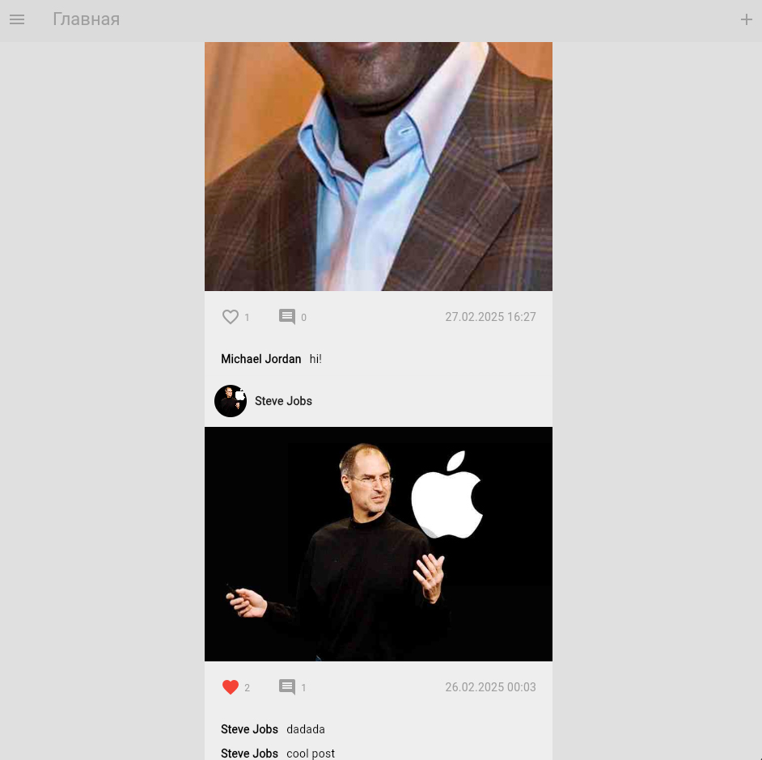
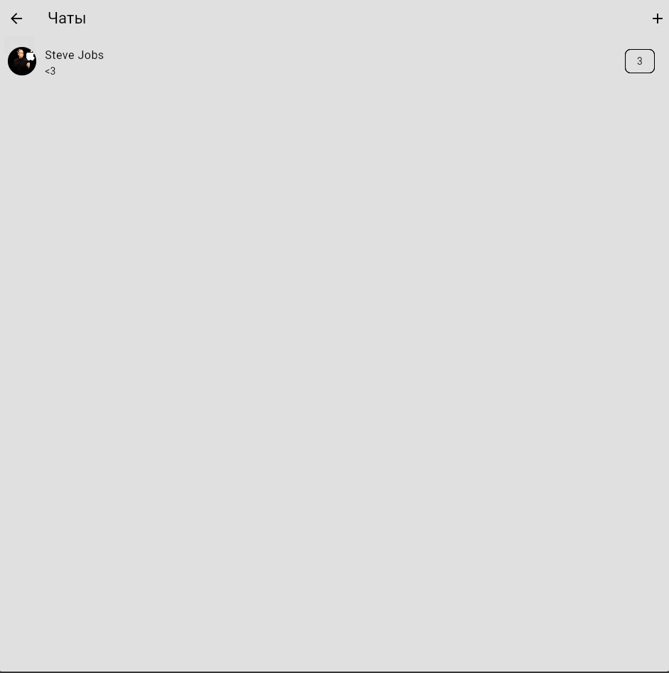
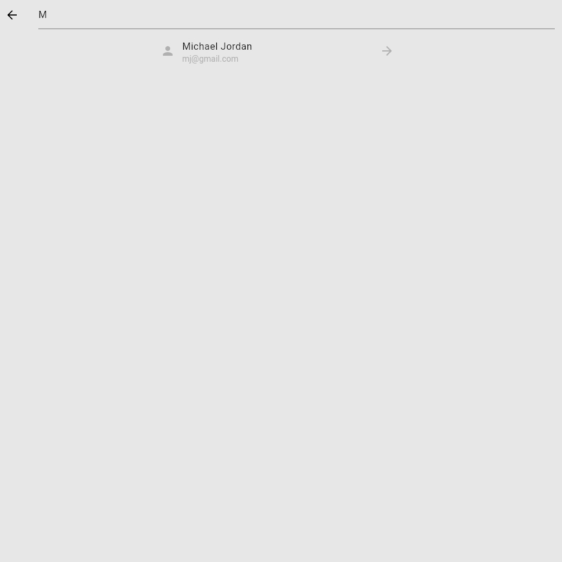
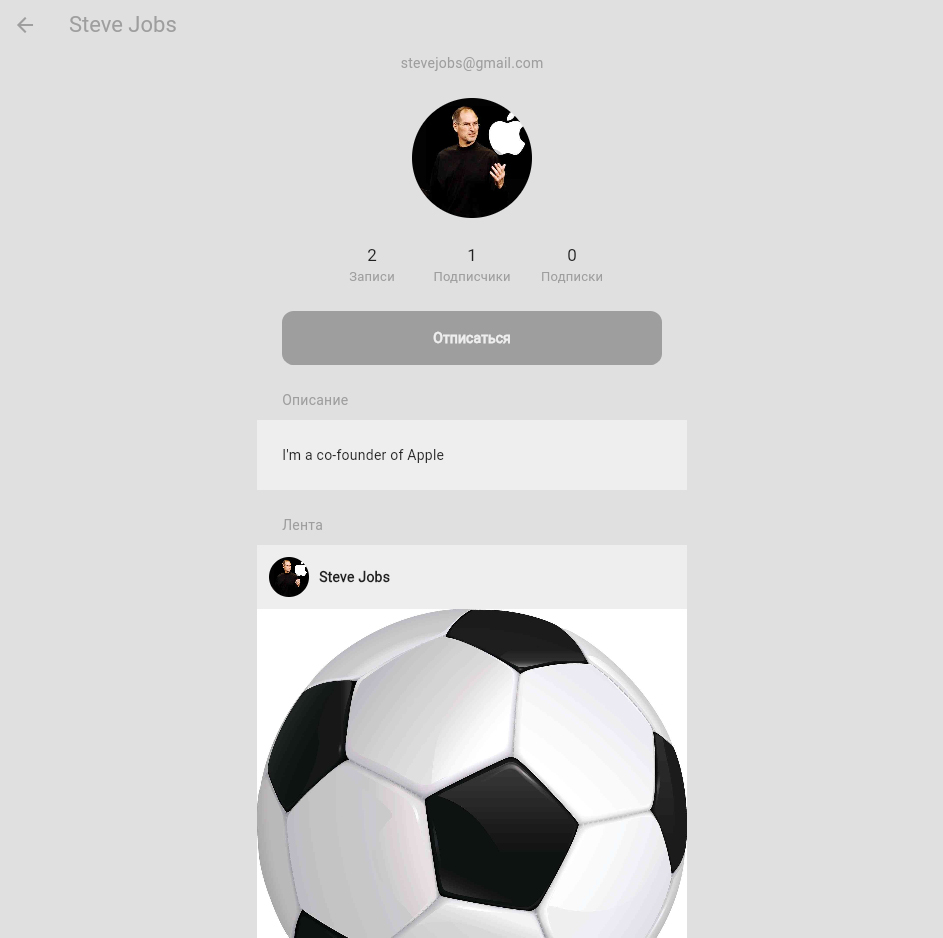

# 📱 Social Media App

Мобильное приложение социальной сети, разработанное на Flutter с использованием Firebase и Supabase. Пользователи могут публиковать посты, просматривать ленту, искать других пользователей, обмениваться сообщениями и управлять профилем. Приложение имеет адаптивный интерфейс и поддержку светлой/тёмной темы.

---

## 🚀 Основные функции

- 🔐 Аутентификация пользователей (Firebase Auth)
- 🏠 Главная лента с постами других пользователей
- ➕ Создание и публикация постов (с изображениями)
- 🔍 Поиск пользователей
- 💬 Реализация чата (в реальном времени)
- 🌙 Переключение темы (тёмная/светлая)
- 👤 Профиль пользователя с настройками
- 📦 Хранение изображений через Supabase

---

## 🧱 Архитектура

Проект структурирован по принципам **Feature-first** и **Clean Architecture**:

```
lib/
├── app.dart
├── main.dart
├── config/           # Настройки Firebase и Supabase
├── responsive/       # Адаптивная вёрстка
├── themes/           # Светлая и тёмная темы + ThemeCubit
├── features/
│   ├── auth/         # Авторизация и регистрация
│   ├── home/         # Главная страница
│   ├── post/         # Работа с постами
│   ├── chat/         # Сообщения (чат)
│   ├── search/       # Поиск пользователей
│   ├── profile/      # Профиль пользователя
│   ├── settings/     # Настройки
│   └── storage/      # Хранение изображений
```

Используется `Cubit` из `flutter_bloc` для управления состоянием.

---

## 🛠️ Технологии

- **Flutter** — UI-фреймворк для кроссплатформенной разработки
- **Dart** — язык программирования
- **Firebase** — аутентификация, Firestore, облачные функции
- **Supabase** — хранение изображений
- **flutter_bloc** — управление состоянием через Cubit
- **Cloud Firestore** — хранение и синхронизация данных в реальном времени

---

## 🖼️ Скриншоты

<p align="center">
  
  <br/>
  <em>Главный экран приложения</em>
</p>

<p align="center">
  
  <br/>
  <em>Экран с перепиской между пользователями</em>
</p>

<p align="center">
  
  <br/>
  <em>Экран поиска пользователей по имени</em>
</p>

<p align="center">
  
  <br/>
  <em>Профиль пользователя с постами</em>
</p>


---

## 📦 Установка и запуск

```bash
git clone https://github.com/your-username/social-media-app.git
cd social-media-app
flutter pub get
flutter run
```

---

## ⚙️ Настройка Firebase и Supabase

1. Создайте проект в [Firebase](https://firebase.google.com/)
2. Активируйте:
   - Authentication (email/password)
   - Firestore
3. Добавьте файл `google-services.json` / `GoogleService-Info.plist` в проект.
4. Настройте хранилище Supabase:
   - Зарегистрируйтесь на https://supabase.io
   - Создайте bucket для изображений
   - Сохраните URL и ключи в `lib/config/constants.dart`

---

## 📄 Лицензия

Проект создан в рамках курсовой работы. Для использования в учебных целях — свободно. Для коммерческого — по согласованию.

---

## 🙋‍♂️ Автор

> Курсовая работа студента [Пряников Родион Иванович]  
> Преподаватель: [Лошкарёв Илья Витальевич]