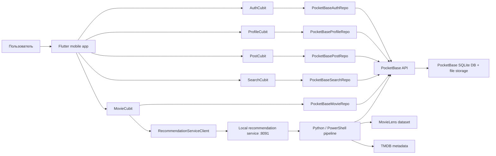
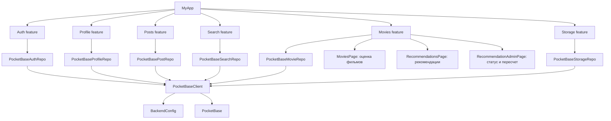
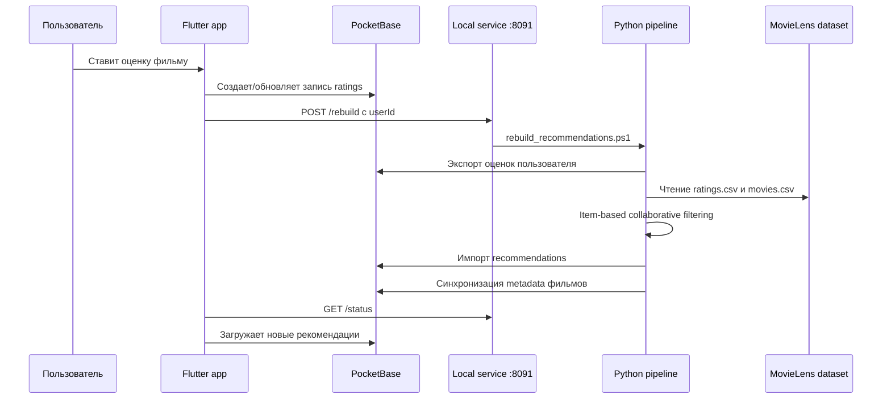
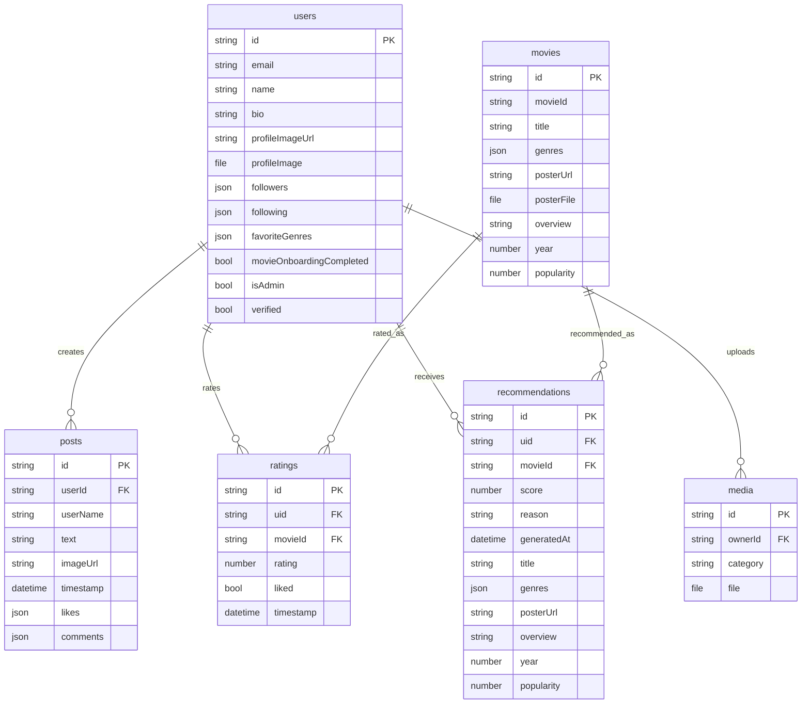
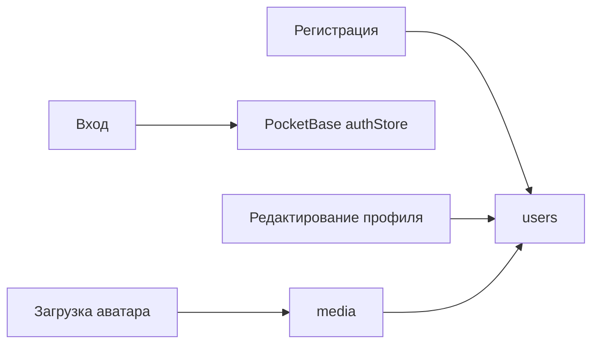
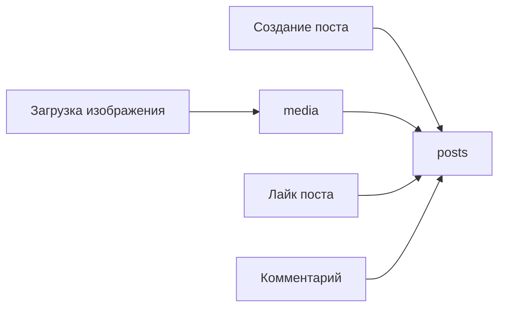
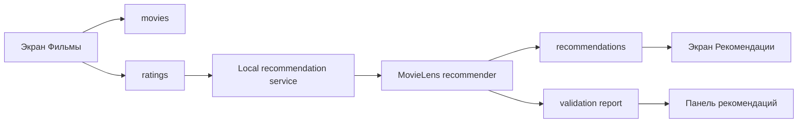

# Схема архитектуры приложения и базы данных

Документ описывает текущую архитектуру проекта: мобильное приложение Flutter, PocketBase как основной backend, локальный сервис пересчета рекомендаций и Python-пайплайн на основе MovieLens.

## Общая архитектура

Главная идея: приложение работает с социальными функциями и фильмами через PocketBase. Рекомендации пересчитываются отдельным локальным сервисом, который запускает Python-скрипты, берет оценки пользователя из PocketBase, объединяет их с MovieLens и записывает результат обратно в коллекцию `recommendations`.

## Архитектура Flutter-приложения

В приложении используется слой репозиториев. UI-экраны не работают с PocketBase напрямую: они обращаются к Cubit, Cubit вызывает репозиторий, а репозиторий уже общается с PocketBase.

## Пайплайн рекомендаций

Алгоритм использует item-based collaborative filtering: строится матрица пользователь-фильм, затем считается похожесть фильмов по паттернам оценок. Оценки текущего пользователя добавляются как новый синтетический пользователь MovieLens.

## Схема базы данных PocketBase

## Коллекции PocketBase

| Коллекция | Назначение | Основные поля |
|---|---|---|
| `users` | Аккаунты пользователей, профиль и роль администратора | `email`, `name`, `bio`, `profileImageUrl`, `profileImage`, `followers`, `following`, `isAdmin` |
| `posts` | Посты социальной сети | `userId`, `userName`, `text`, `imageUrl`, `timestamp`, `likes`, `comments` |
| `media` | Загруженные файлы профиля и постов | `ownerId`, `category`, `file` |
| `movies` | Каталог фильмов из MovieLens, обогащенный TMDB | `movieId`, `title`, `genres`, `posterUrl`, `posterFile`, `overview`, `year`, `popularity` |
| `ratings` | Оценки и лайки фильмов конкретного пользователя | `uid`, `movieId`, `rating`, `liked`, `timestamp` |
| `recommendations` | Персональные рекомендации пользователя | `uid`, `movieId`, `score`, `reason`, `generatedAt`, metadata фильма |

## Основные сценарии данных

### Регистрация и профиль

### Посты

### Фильмы и рекомендации

## Локальные сервисы и конфигурация

| Компонент | По умолчанию | Назначение |
|---|---:|---|
| PocketBase | `http://10.0.2.2:8090` в Android emulator, `http://127.0.0.1:8090` на компьютере | Основная база данных и файловое хранилище |
| Recommendation service | `http://10.0.2.2:8091` в Android emulator, `http://127.0.0.1:8091` на компьютере | HTTP-обертка над локальным пересчетом рекомендаций |
| MovieLens dataset | `assets/db/ml-latest-small` | Источник исторических оценок и каталога фильмов |
| TMDB | внешний API | Постеры, описания, жанры и популярность фильмов |

Ключевые настройки находятся в `lib/config/backend_config.dart`. Для локального запуска на Android emulator приложение использует `10.0.2.2`, потому что `127.0.0.1` внутри emulator указывает на сам emulator, а не на компьютер.

## Где находится код

| Часть | Путь |
|---|---|
| PocketBase config | `lib/config/backend_config.dart`, `lib/config/pocketbase_client.dart` |
| Auth/Profile/Post/Search/Storage repos | `lib/features/*/data/pocketbase_*_repo.dart` |
| Movies feature | `lib/features/movies/` |
| Recommendation UI | `lib/features/movies/presentation/pages/recommendations_page.dart` |
| Admin panel | `lib/features/movies/presentation/pages/recommendation_admin_page.dart` |
| Python pipeline | `tools/recommendation_pipeline/` |
| Setup docs | `docs/pocketbase_setup.md`, `tools/recommendation_pipeline/README.md` |
