# Реализация сбора данных и расчета рекомендаций

Эти схемы удобно использовать как два отдельных слайда презентации. Первая показывает, как приложение собирает пользовательские оценки фильмов. Вторая показывает, как эти оценки превращаются в персональные рекомендации.

## Схема 1. Сбор пользовательских оценок

```mermaid
%%{init: {"theme": "base", "themeVariables": {"background": "#FFFFFF", "fontFamily": "Arial, sans-serif", "fontSize": "18px", "primaryColor": "#FFFFFF", "primaryTextColor": "#0F172A", "primaryBorderColor": "#1D4ED8", "secondaryColor": "#F1F5F9", "secondaryTextColor": "#0F172A", "secondaryBorderColor": "#334155", "tertiaryColor": "#ECFDF5", "tertiaryTextColor": "#064E3B", "tertiaryBorderColor": "#059669", "lineColor": "#334155", "textColor": "#0F172A", "edgeLabelBackground": "#FFFFFF"}}}%%
flowchart LR
    User["Пользователь"] --> MoviesScreen["Экран Фильмы"]
    MoviesScreen --> MovieCard["Карточка фильма"]

    MovieCard --> RatingAction["Оценка 1-5 звезд"]
    MovieCard --> LikeAction["Лайк / избранное"]

    RatingAction --> MovieCubit["MovieCubit"]
    LikeAction --> MovieCubit

    MovieCubit --> RatingModel["MovieRating\nuid, movieId, rating, liked"]
    RatingModel --> MovieRepo["PocketBaseMovieRepo"]
    MovieRepo --> PocketBaseApi["PocketBase API"]

    PocketBaseApi --> ExistingCheck{"Запись уже есть?"}
    ExistingCheck -->|да| UpdateRating["Обновить rating / liked"]
    ExistingCheck -->|нет| CreateRating["Создать новую оценку"]

    UpdateRating --> Ratings[("ratings")]
    CreateRating --> Ratings

    Ratings --> ProfileCheck{"Оценок достаточно?"}
    ProfileCheck -->|меньше 5| NeedMore["Показать подсказку\nо нехватке оценок"]
    ProfileCheck -->|5+| AutoRebuild["Запустить автопересчет\nрекомендаций"]

    classDef source fill:#EFF6FF,stroke:#2563EB,color:#0F172A
    classDef action fill:#FFFFFF,stroke:#334155,color:#0F172A
    classDef db fill:#ECFDF5,stroke:#059669,color:#064E3B
    classDef decision fill:#FFFBEB,stroke:#D97706,color:#78350F

    class User source
    class MoviesScreen,MovieCard,RatingAction,LikeAction,MovieCubit,RatingModel,MovieRepo,PocketBaseApi,UpdateRating,CreateRating,NeedMore,AutoRebuild action
    class Ratings db
    class ExistingCheck,ProfileCheck decision
```

### Что показывает схема

1. Пользователь открывает экран фильмов и ставит оценку или лайк.
2. Flutter сохраняет действие через `MovieCubit` и `PocketBaseMovieRepo`.
3. В PocketBase создается или обновляется запись в коллекции `ratings`.
4. После достаточного количества оценок приложение может запустить автоматический пересчет рекомендаций.

## Схема 2. Вычислительный pipeline расчета рекомендаций

```mermaid
%%{init: {"theme": "base", "themeVariables": {"background": "#FFFFFF", "fontFamily": "Arial, sans-serif", "fontSize": "18px", "primaryColor": "#FFFFFF", "primaryTextColor": "#0F172A", "primaryBorderColor": "#1D4ED8", "secondaryColor": "#F1F5F9", "secondaryTextColor": "#0F172A", "secondaryBorderColor": "#334155", "tertiaryColor": "#ECFDF5", "tertiaryTextColor": "#064E3B", "tertiaryBorderColor": "#059669", "lineColor": "#334155", "textColor": "#0F172A", "edgeLabelBackground": "#FFFFFF"}}}%%
flowchart LR
    Ratings[("ratings")] --> ExportRatings["pocketbase_export_ratings.py"]
    Movies[("movies")] --> Recommender["movielens_recommender.py\nitem-based collaborative filtering"]
    MovieLens["MovieLens dataset\nmovies.csv / ratings.csv / links.csv"] --> Recommender

    AppTrigger["Flutter\nавтопересчет или админ-кнопка"] --> LocalService["recommendation_service.py\n/status /rebuild"]
    LocalService --> RebuildScript["rebuild_recommendations.ps1"]

    RebuildScript --> ExportRatings
    ExportRatings --> UserRatingsJson["user_ratings_UID.json"]
    UserRatingsJson --> Recommender

    Recommender --> RecommendationsJson["recommendations_UID.json"]
    Recommender --> ValidationReport["recommendation_report_UID.json\nPrecision, Recall, nDCG, top-50/top-100"]

    RecommendationsJson --> ImportRecommendations["pocketbase_import_json.py"]
    ImportRecommendations --> Recommendations[("recommendations")]

    Recommendations --> RecommendationsScreen["Экран рекомендаций"]
    ValidationReport --> AdminPanel["Админ-панель рекомендаций"]
    ValidationReport --> Comparison["compare_recommendation_runs.py\nсравнение с прошлым запуском"]

    classDef source fill:#EFF6FF,stroke:#2563EB,color:#0F172A
    classDef action fill:#FFFFFF,stroke:#334155,color:#0F172A
    classDef db fill:#ECFDF5,stroke:#059669,color:#064E3B
    classDef report fill:#FFFBEB,stroke:#D97706,color:#78350F

    class AppTrigger,MovieLens source
    class ExportRatings,Recommender,LocalService,RebuildScript,ImportRecommendations,RecommendationsScreen,AdminPanel,Comparison action
    class Ratings,Movies,Recommendations db
    class UserRatingsJson,RecommendationsJson,ValidationReport report
```

### Что показывает схема

1. Локальный сервис получает команду пересчета из приложения.
2. Скрипт выгружает оценки конкретного пользователя из `ratings`.
3. Python-пайплайн сравнивает пользовательский профиль с MovieLens и строит рекомендации методом item-based collaborative filtering.
4. Готовые рекомендации импортируются в PocketBase в коллекцию `recommendations`.
5. Отчет качества показывается в админ-панели и используется для защиты диплома.
