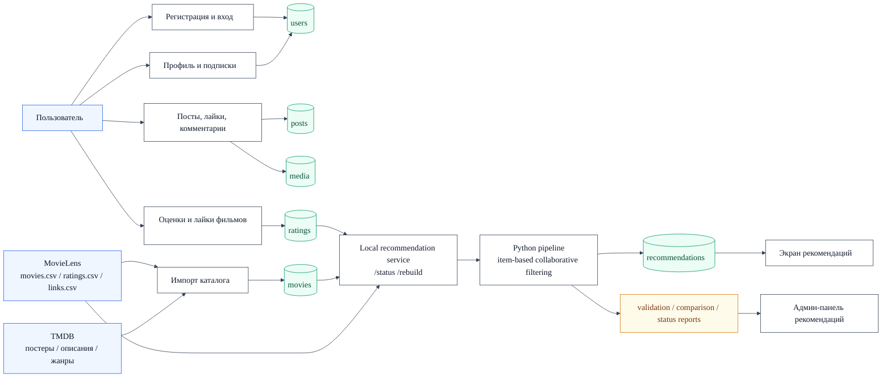

# Реализация сбора данных

Эту схему удобно использовать для слайда презентации. Она показывает, какие данные собирает приложение, где они сохраняются и как затем используются в рекомендательной системе.

## Краткое объяснение

1. Пользовательские действия формируют данные в `users`, `posts`, `media` и `ratings`.
2. Каталог фильмов создается из MovieLens и обогащается TMDB-метаданными.
3. Оценки из `ratings` становятся входом для локального сервиса рекомендаций.
4. Python-пайплайн строит персональные рекомендации и сохраняет их в `recommendations`.
5. Отчеты качества используются в админ-панели для демонстрации и проверки результата.
