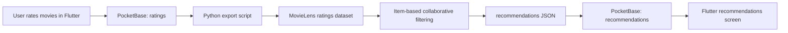

# Recommendation System for Diploma Defense

## What was built

The application contains a separate movie recommendation module inside the Flutter social network. A user can rate movies and mark them as liked, after which the system generates a personalized recommendation list.

The mobile client is responsible for:

- collecting user ratings;
- showing the movie catalog;
- showing the resulting recommendations.

The offline Python pipeline is responsible for:

- exporting user ratings from PocketBase;
- combining them with MovieLens;
- computing recommendations;
- writing the results back to PocketBase.

## Algorithm

The recommendation algorithm is **item-based collaborative filtering**.

In simple terms:

1. We build a user-movie rating matrix from MovieLens.
2. We add the current application user to this matrix.
3. We calculate cosine similarity between movies.
4. If the user rated movie A highly, the system looks for movies that have a similar rating pattern among other users.
5. Similar unseen movies receive a recommendation score and are ranked.

This approach was chosen because it is:

- easy to explain in a diploma;
- based on a classic and academically recognizable method;
- suitable for a prototype with a public dataset.

## Pipeline Scheme

## Why MovieLens was used

MovieLens was selected because:

- it is a well-known public recommendation dataset;
- it contains a large number of user ratings;
- it is suitable for collaborative filtering experiments;
- it helps avoid manually inventing artificial training users.

In the diploma, MovieLens can be described as the historical rating base of the system, while the current mobile app user is added as a new participant whose preferences are analyzed against that background.

## What can be shown during defense

Recommended demonstration scenario:

1. A user logs into the application.
2. The user rates 15-20 movies on the movie screen.
3. The administrator opens the recommendation panel.
4. The recommendation rebuild script is launched from the host computer.
5. The recommendations screen is refreshed.
6. The updated recommendation list with posters, descriptions, and scores is shown.

## Qualitative metrics to mention

For the diploma demo, the following lightweight metrics are enough:

- how many movies the user has rated;
- how many recommendations were generated;
- the average recommendation score;
- the dominant genres in the recommendation list;
- whether the top recommendations changed after new ratings were added.

These values are partially visible in the in-app admin panel, and the rebuild script can also generate a small comparison report between consecutive runs.

## Limitations

- The recommendation rebuild is currently run on the host computer through PowerShell, not directly on the phone.
- The algorithm is intentionally simple and diploma-friendly, not production-grade.
- Recommendation quality depends on how many movies the user has rated.

## Practical result

The final system works end-to-end:

- Flutter collects ratings;
- PocketBase stores user and movie data;
- Python calculates personalized recommendations from MovieLens;
- the app displays the resulting recommendations to the user.
